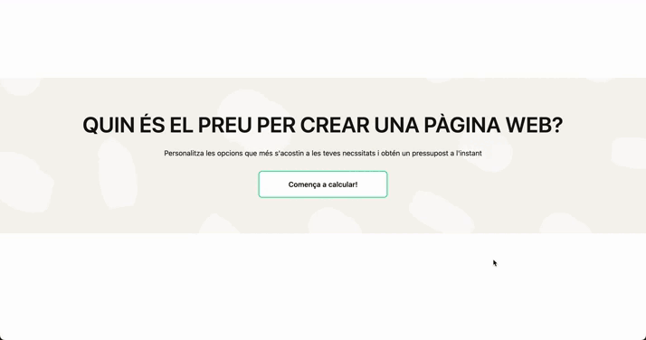

# Budget App

Budget App is a project built with React, Typescript and Tailwind to help you create a budget for building a web page.

You can choose the services that fits you, bewtween SEO, Ads and Web. Additionally, you can customize the Web serivce by selecting the number of pages and languages that you need. By modifying the services, you will recieve the exact price.

Note that you can get a 20% discount if you choose to pay annually compared to monthly.

By providing some personal information (name, phone and email), you can generate as many budgets as you need!

## Here's a demonstration of what you will find:

## Built with:

## Roadmap

Upcoming features planned for this project:

- Implement testing.
- Add specific requirements to budget request inputs.
- Improve SOLID principles

## Contributions:

Contributions are welcome & appreciated from everyone!

If you would like to contribute, please follow these steps:

1\. Fork the repository.  
 2\. Create a branch for your changes.  
 3\. Make your changes.  
 4\. Test your changes.  
 5\. Commit your changes.  
 6\. Push your changes to your fork.  
 7\. Open a pull request.

## Authors

- [@mllenas12](https://www.github.com/mllenas12)
